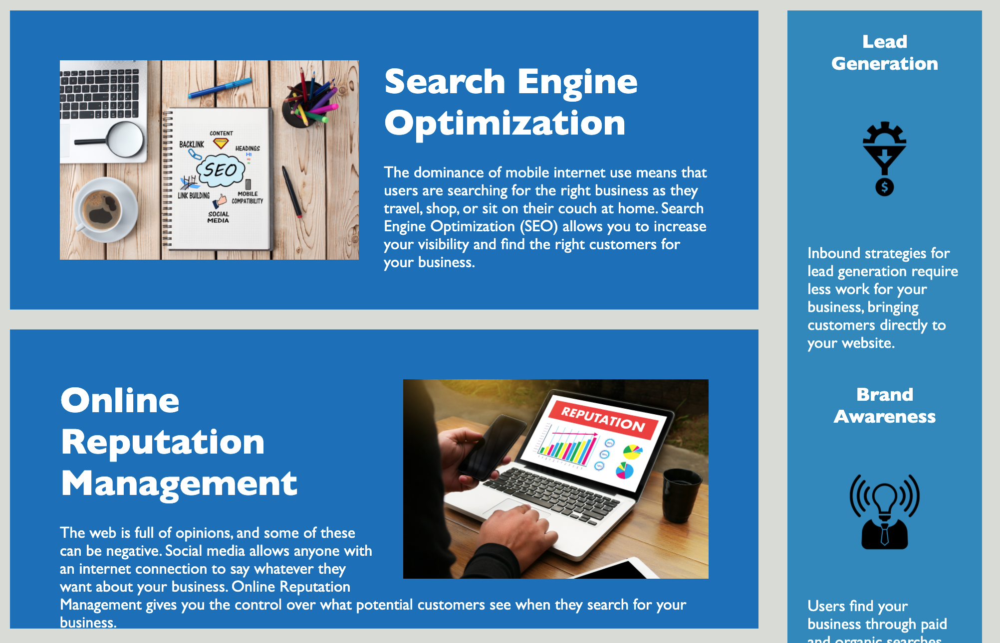

# Horiseon Code Refactoring
Horiseon is a marketing agency requiring its webpage to follow accessibility standards in order to optimize it for search engines

Link to the deployed application:  https://richardguarnieri.github.io/horiseon-code-refactoring/

## Refactoring
When working with this code, I did the utmost to adhere to the **Scout Rule** — which says to always leave the code a little cleaner than when you found it.

The outcome is a refactored code - it now follows semantic HTML elements, the page follows a logical structure independent of styling and positioning, there are accessible alt attributes, and all elements fall in sequential order.

## App Image

*Brief look at the page*